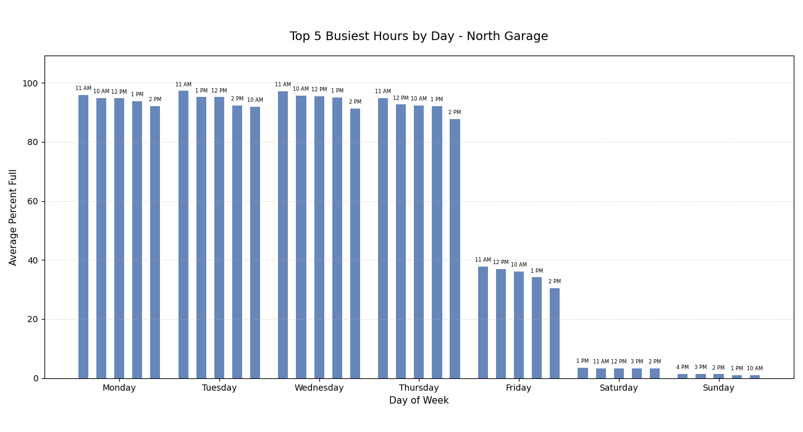

# Parking Utilization Data Pipeline & Analysis

## Overview

This project analyzes parking garage utilization at San Jose State University by building an end-to-end data pipeline that collects, processes, and visualizes real-world parking data.

Using Python, SQL, and automated data collection via a Raspberry Pi, I gathered over 29,000 observations and performed time-series analysis to identify peak usage patterns across garages and weekdays.

---

## Data Collection

* Built a Python script to scrape parking availability data
* Automated collection at 5-minute intervals around ~26 days
* Generated a dataset of 29,000+ observations
* Stored raw data using Google Sheets and local storage

---

## Data Cleaning

* Standardized inconsistent values (e.g., "Full" → 100%)
* Preserved timestamps in ISO 8601 format
* Applied transformations during analysis to extract local hour and weekday features

---

## Data

This repository includes sample datasets for demonstration:

* SJSU-PARKING-STATUS-DATA-raw.csv → original collected data
* Cleaned_Data.csv → cleaned dataset with standardized values

---

## SQL Analysis

Performed analysis using SQLite, including:

* Average utilization by hour of day
* Weekday vs weekend comparisons
* Percentage of time garages reach full capacity
* Top 5 busiest hours per garage per weekday

Key SQL techniques used:

* GROUP BY and aggregation
* CASE statements
* Subqueries and CTEs
* Window functions (ROW_NUMBER, DENSE_RANK)

---

## Visualization

Used Python (pandas + matplotlib) to generate:

* Time-series charts of parking utilization
* Grouped bar charts showing top 5 busiest hours by day
* Visual comparison of usage patterns across garages

Example output:

---

## Key Insights

* There are generally three different types of days for a normal garage on campus with predictable yet distinct behaviour. Weedays (Monday-Thursday), Fridays, and Weekends.
* South Parking Garage undercounts how many people leave the garage. They adjust the data down about 40% at midnight
* People fill up the garages earlier in the day earlier in the week, but start to show up later as the week drags on.
* Despite how full it feels, the west garage is only usually full capacity for about an hour on any given day
* Demand patterns are consistent across multiple weeks

---

## Tools Used

* Python (pandas, matplotlib)
* SQLite
* Google Sheets API
* Raspberry Pi (data collection)

---

## Project Structure

parking-data-analysis/

* data/
* sql/
* python/
* images/
* README.md
* .gitignore

---

## How to Run

1. Run SQL scripts in the sql/ folder to clean and analyze data
2. Export query results to CSV
3. Run the visualization script:

python python/grouped_bar_chart.py

---

## Data Collection Note

The data collection script requires a Google Cloud API key.
For security reasons, API keys and credentials are not included in this repository.
To run the script, users must provide their own credentials via environment variables.

---

## Future Improvements

* Replace Google Sheets with a scalable database
* Build an interactive dashboard (e.g., Streamlit)
* Extend analysis with predictive modeling

---

## One last thing (SSL Workaround)

The scraper currently uses `verify=False` when making requests.

This was required because of SSL certificate issues on the Raspberry Pi. Without it, the request fails. 

Since this project only reads public data and doesn’t send anything sensitive I deemed it acceptable for the sake of progression through the project.

 A proper fix would involve configuring certificate verification correctly.
